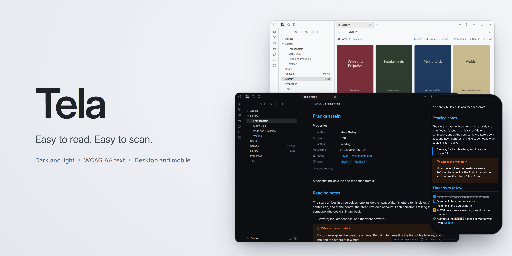
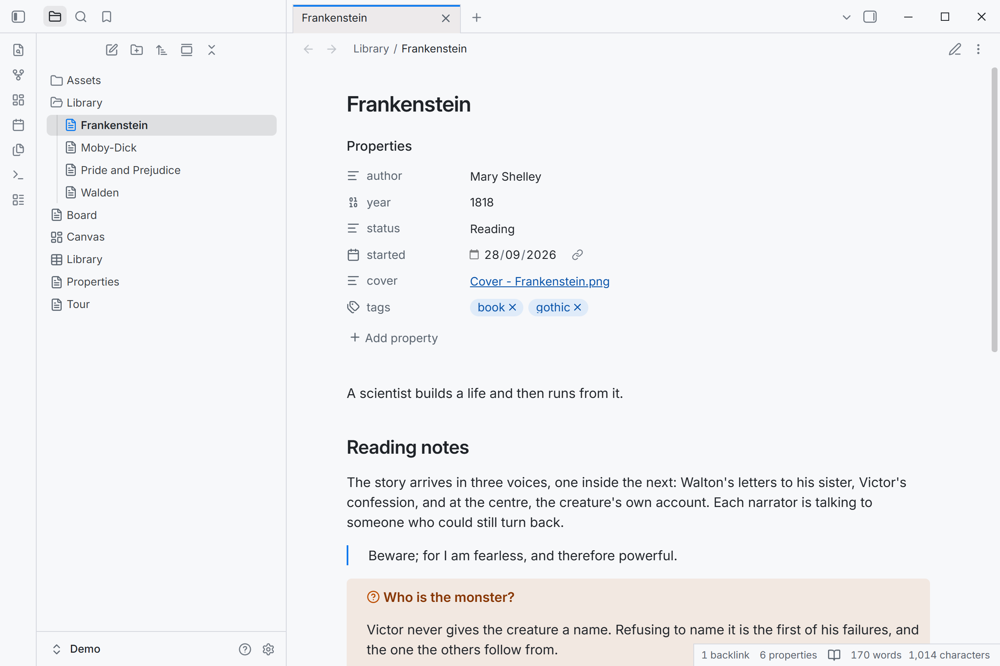
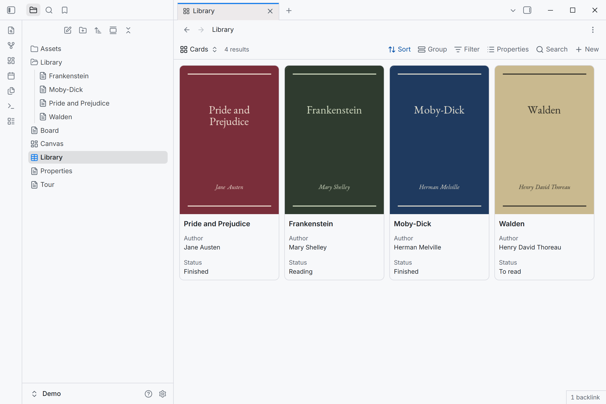
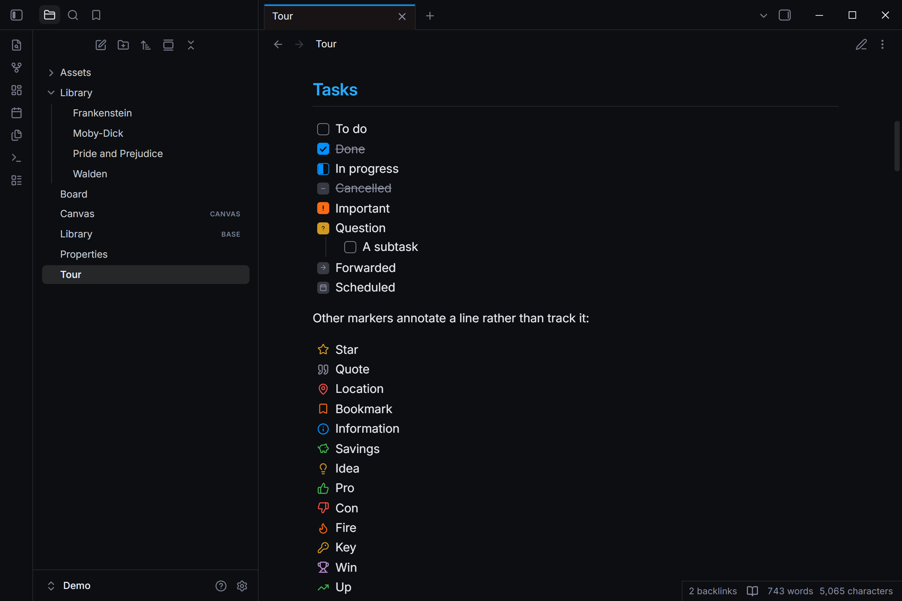
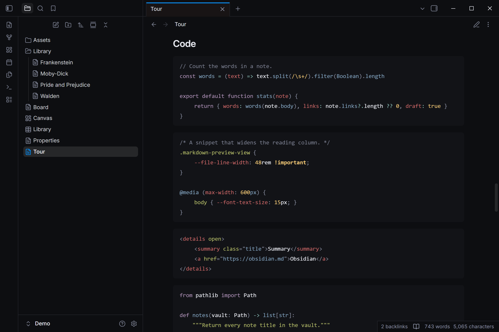
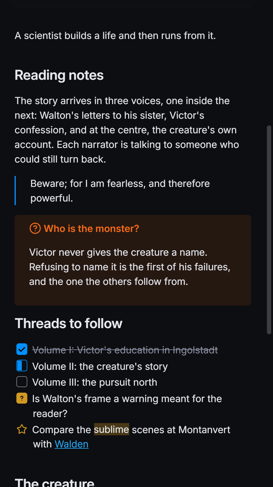
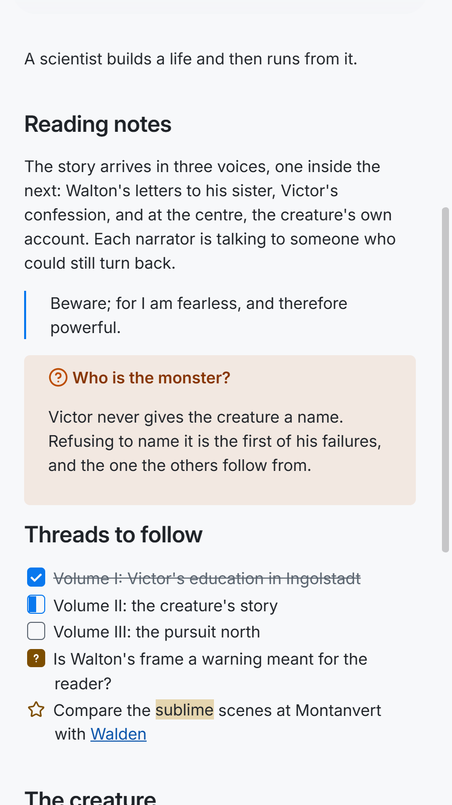
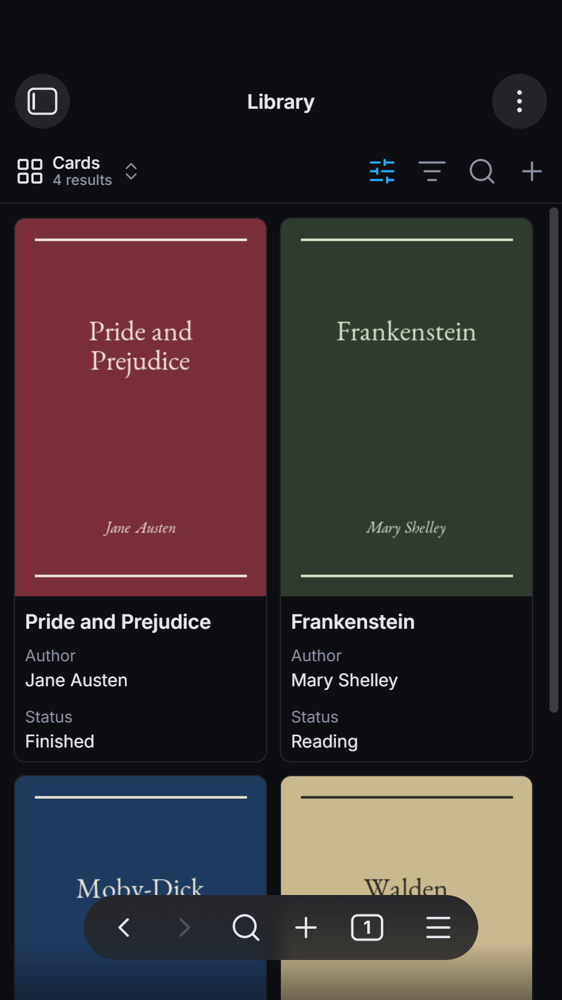

An Obsidian theme inspired by the style guide of the Tela app. It supports dark and light
mode, on desktop, phone and tablet.

Work in progress: not yet in the community directory.

## Screenshots

<table>
  <tr>
    <td width="50%"><br>Notes and properties</td>
    <td width="50%"><br>Bases cards</td>
  </tr>
  <tr>
    <td><br>Twenty task marks</td>
    <td><br>Code in Tela's terminal colours</td>
  </tr>
</table>

<table>
  <tr>
    <td width="33%"></td>
    <td width="33%"></td>
    <td width="33%"></td>
  </tr>
</table>

## Why Tela

- **Calm, legible and ready as installed.** One quiet surface for sidebars, tabs and
  notes, hairline borders, and nothing to set up.
- **Readable text.** Every text colour clears WCAG AA (4.5:1) in dark and light
  mode, on desktop, phone and tablet. An
  [automated contrast audit](CONTRIBUTING.md#qa) of notes, Canvas, Bases, search,
  menus and settings checks this before each release.
- **Built to survive Obsidian updates.** The theme works through Obsidian's own variables
  rather than fragile selectors, and a [weekly check](CONTRIBUTING.md#obsidian-updates)
  tests each new Obsidian release for changes that would break it.

## Features

- Dark and light palettes taken from the Tela app, with its blue accent. Your own accent
  colour in Settings → Appearance still applies.
- Code blocks in the colours of Tela's terminal, every one readable on the code
  background.
- Tasks with their own marks for important `[!]`, question `[?]`, cancelled `[-]` and in
  progress `[/]`.
- Headings at one weight in a gentle size scale. H1 and H2 take the accent, with a
  hairline under them; H3 mixes the accent into body ink; the two smallest levels stay muted.
- Unresolved links keep full colour, with a dashed underline instead of fading.
- Phone and tablet keep the desktop palette rather than switching to pure black.
- Printing and PDF export keep callouts, code blocks, tables and images on one page, and
  each heading on the page of the text it introduces.

## Settings

With the [Style Settings](https://github.com/obsidian-community/obsidian-style-settings)
plugin, the theme has one option:

- **Distinct sidebars** gives the sidebars a recessed surface of their own.

## Fonts

The theme sets Inter, which Obsidian ships with, for the interface and notes, and your
system's monospace font for code. Your choices in Settings → Appearance → Font always win
over the theme's.

## Compatibility

Obsidian 1.13.4 or later, on desktop and mobile. Checked with the Dataview, Tasks, Kanban,
Excalidraw and Iconize plugins, and with right-to-left text. File-tree icons are left to a
plugin such as Iconize.

## Verifying a release

Each release's `theme.css` and `manifest.json` carry signed build provenance. To check
that a downloaded `theme.css` was built by this repository's release workflow:

```sh
gh attestation verify theme.css -R rbartoli/obsidian-tela-theme
```

## Licence

[MIT](LICENSE)
