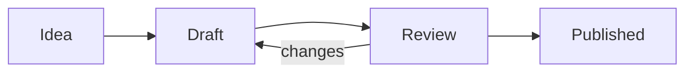

This note holds every element a theme styles, so you can judge the theme on real notes. Switch between light and dark in **Settings → Appearance**. The other notes cover the rest: [[Properties]], [[Canvas.canvas|the canvas]], [[Library.base|the library]] and the reading [[Board]].

## Text

A paragraph of body text, with **bold**, *italic*, ***bold italic***, ~~strikethrough~~, ==highlight==, `inline code` and keys such as <kbd>Ctrl</kbd> + <kbd>P</kbd>. Tags look like #reading and #theme/demo. A footnote sits here,[^1] and an inline footnote here.^[Inline footnotes keep the text and its note together.]

Links come in several kinds: an internal link to [[Properties]], an aliased link to [[Properties#Status|the status section]], a link to a note that doesn't exist yet, [[Unwritten note]], an external link to [obsidian.md](https://obsidian.md), and a bare address, https://obsidian.md.

A line can break here  
without starting a new paragraph. %% Comments like this one only show while you edit. %%

## Lists

- An unordered list
	- with a nested item
		- and one more level
- back at the top level

1. An ordered list
2. with a second item
	- and a nested bullet
3. and a third

## Tasks

- [ ] To do
- [x] Done
- [/] In progress
- [-] Cancelled
- [!] Important
- [?] Question
	- [ ] A subtask
- [>] Forwarded
- [<] Scheduled

Other markers annotate a line rather than track it:

- [*] Star
- ["] Quote
- [l] Location
- [b] Bookmark
- [i] Information
- [S] Savings
- [I] Idea
- [p] Pro
- [c] Con
- [f] Fire
- [k] Key
- [w] Win
- [u] Up
- [d] Down

## Quotes

> A quotation, set off from the text around it.
>
> > A quotation inside a quotation.

## Callouts

> [!note]
> A note callout. Each callout type has its own colour and icon.

> [!abstract]
> An abstract callout, also written `summary` or `tldr`.

> [!info]
> An info callout.

> [!todo]
> A to-do callout.

> [!tip]
> A tip callout, also written `hint` or `important`.

> [!success]
> A success callout, also written `check` or `done`.

> [!question]
> A question callout, also written `help` or `faq`.

> [!warning]
> A warning callout, also written `caution` or `attention`.

> [!failure]
> A failure callout, also written `fail` or `missing`.

> [!danger]
> A danger callout, also written `error`.

> [!bug]
> A bug callout.

> [!example]
> An example callout.

> [!quote]
> A quote callout, also written `cite`.

> [!tip]- A folded callout
> Click the title to open it.

> [!info] A callout with its own title
> > [!success] A nested callout
> > Callouts can sit inside callouts.

## Code

```js
// Count the words in a note.
const words = (text) => text.split(/\s+/).filter(Boolean).length

export default function stats(note) {
	return { words: words(note.body), links: note.links?.length ?? 0, draft: true }
}
```

```css
/* A snippet that widens the reading column. */
.markdown-preview-view {
	--file-line-width: 48rem !important;
}

@media (max-width: 600px) {
	body { --font-text-size: 15px; }
}
```

```html
<details open>
	<summary class="title">Summary</summary>
	<a href="https://obsidian.md">Obsidian</a>
</details>
```

```python
from pathlib import Path

def notes(vault: Path) -> list[str]:
    """Return every note title in the vault."""
    return sorted(p.stem for p in vault.rglob("*.md") if not p.name.startswith("."))
```

```yaml
title: Tour
tags: [demo, theme]
rating: 4.5
draft: false
```

```json
{ "cssTheme": "Tela", "theme": "system", "accentColor": "" }
```

```markdown
# A heading
Some **bold** text and a [link](https://obsidian.md).

| Column | Column |
| ------ | ------ |
| Cell   | Cell   |
```

```bash
# Rebuild and report the time.
npm run build && echo "built at $(date +%H:%M)"
```

## Tables

| Book                | Author              | Year | Rating |
| :------------------ | :------------------ | :--: | -----: |
| Moby-Dick           | Herman Melville     | 1851 |      4 |
| Pride and Prejudice | Jane Austen         | 1813 |      5 |
| Frankenstein        | Mary Shelley        | 1818 |      4 |
| Walden              | Henry David Thoreau | 1854 |      3 |

## Embeds

![[Dusk.png]]

A section embedded from another note:

![[Properties#Status]]

## Maths

Inline maths, $e^{i\pi} + 1 = 0$, sits in the line. Block maths stands on its own:

$$
\int_0^1 x^2 \, dx = \frac{1}{3}
$$

## Diagrams



## Dividers

Three dashes make a horizontal rule.

---

## Headings

The last section shows every heading level, each over a paragraph.

# Heading 1

A paragraph under a first-level heading.

## Heading 2

A paragraph under a second-level heading.

### Heading 3

A paragraph under a third-level heading.

#### Heading 4

A paragraph under a fourth-level heading.

##### Heading 5

A paragraph under a fifth-level heading.

###### Heading 6

A paragraph under a sixth-level heading.

**A bold paragraph** sits between body text and a heading. That's the tour; footnotes collect below.

[^1]: A footnote, numbered in the order it appears.
