## Flowchart

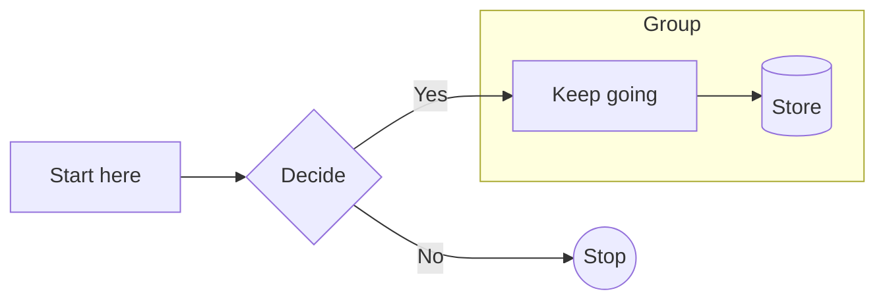
```mermaid
flowchart LR
  A[Start here] --> B{Decide}
  B -->|Yes| C[Keep going]
  B -->|No| D((Stop))
  subgraph Group
    C --> E[(Store)]
  end
```

## Sequence

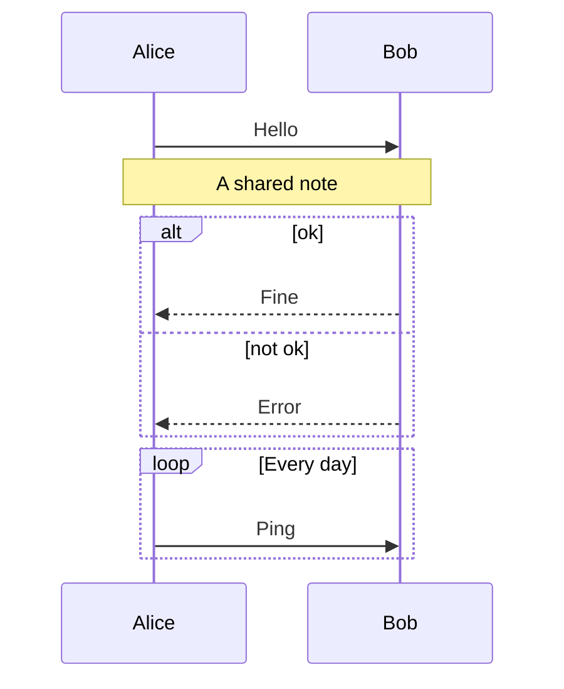
```mermaid
sequenceDiagram
  participant A as Alice
  participant B as Bob
  A->>B: Hello
  Note over A,B: A shared note
  alt ok
    B-->>A: Fine
  else not ok
    B-->>A: Error
  end
  loop Every day
    A->>B: Ping
  end
```

## Class

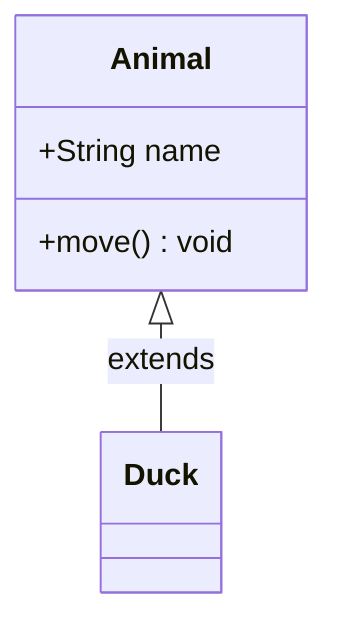
```mermaid
classDiagram
  class Animal {
    +String name
    +move() void
  }
  class Duck
  Animal <|-- Duck : extends
```

## State

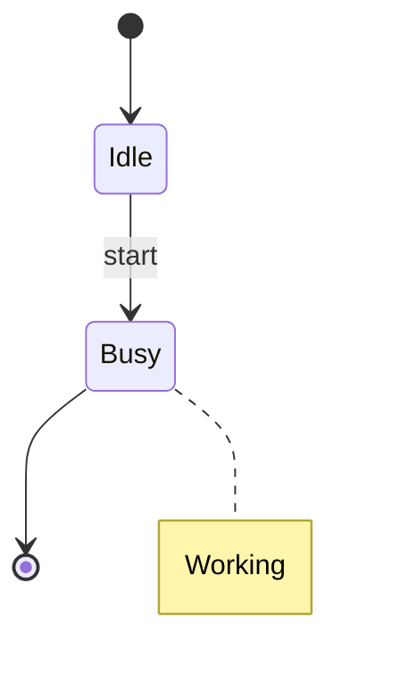
```mermaid
stateDiagram-v2
  [*] --> Idle
  Idle --> Busy : start
  Busy --> [*]
  note right of Busy : Working
```

## Entity relationship

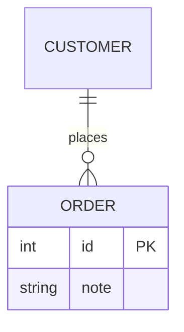
```mermaid
erDiagram
  CUSTOMER ||--o{ ORDER : places
  ORDER {
    int id PK
    string note
  }
```

## Gantt

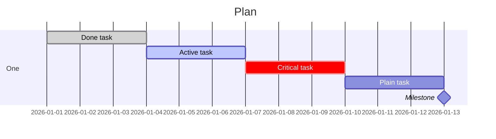
```mermaid
gantt
  title Plan
  dateFormat YYYY-MM-DD
  section One
  Done task :done, a1, 2026-01-01, 3d
  Active task :active, a2, after a1, 3d
  Critical task :crit, a3, after a2, 3d
  Plain task :a4, after a3, 3d
  Milestone :milestone, m1, after a4, 0d
```

## Pie

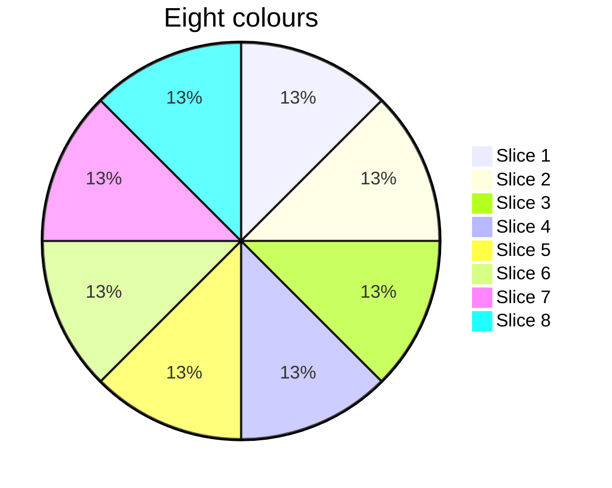
```mermaid
pie title Eight colours
  "Slice 1" : 10
  "Slice 2" : 10
  "Slice 3" : 10
  "Slice 4" : 10
  "Slice 5" : 10
  "Slice 6" : 10
  "Slice 7" : 10
  "Slice 8" : 10
```

## Journey

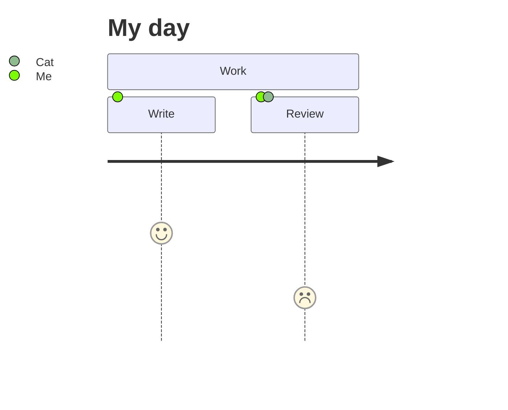
```mermaid
journey
  title My day
  section Work
    Write: 5: Me
    Review: 2: Me, Cat
```

## Mind map

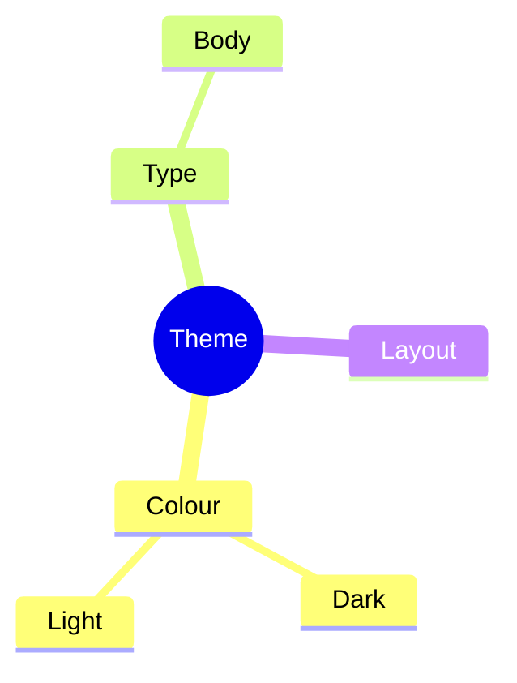
```mermaid
mindmap
  root((Theme))
    Colour
      Dark
      Light
    Type
      Body
    Layout
```

## Timeline

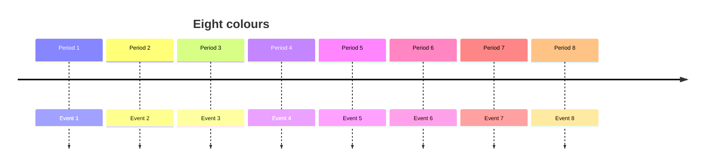
```mermaid
timeline
  title Eight colours
  Period 1 : Event 1
  Period 2 : Event 2
  Period 3 : Event 3
  Period 4 : Event 4
  Period 5 : Event 5
  Period 6 : Event 6
  Period 7 : Event 7
  Period 8 : Event 8
```

## Git graph

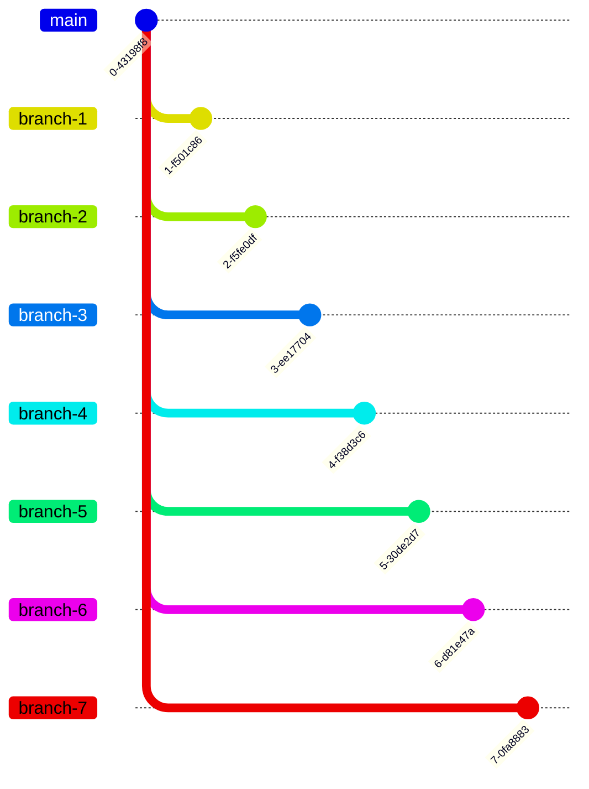
```mermaid
gitGraph
  commit
  branch branch-1
  commit
  checkout main
  branch branch-2
  commit
  checkout main
  branch branch-3
  commit
  checkout main
  branch branch-4
  commit
  checkout main
  branch branch-5
  commit
  checkout main
  branch branch-6
  commit
  checkout main
  branch branch-7
  commit
  checkout main
```

## Quadrant

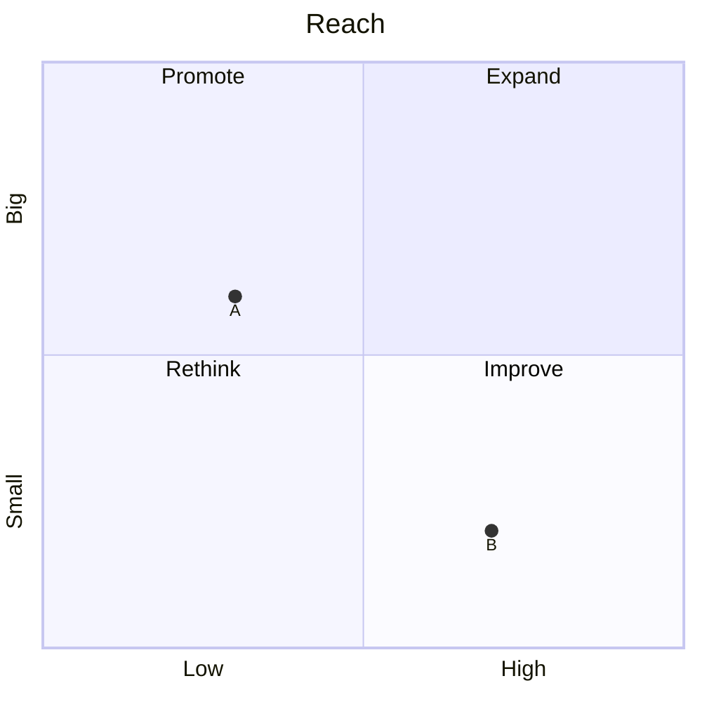
```mermaid
quadrantChart
  title Reach
  x-axis Low --> High
  y-axis Small --> Big
  quadrant-1 Expand
  quadrant-2 Promote
  quadrant-3 Rethink
  quadrant-4 Improve
  A: [0.3, 0.6]
  B: [0.7, 0.2]
```

## XY chart

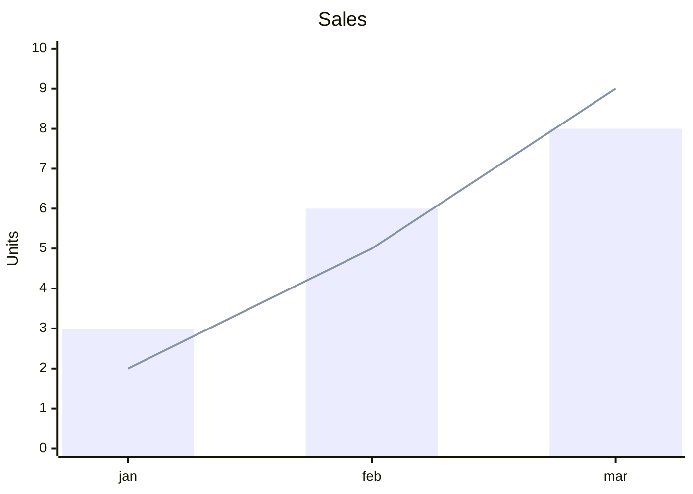
```mermaid
xychart-beta
  title "Sales"
  x-axis [jan, feb, mar]
  y-axis "Units" 0 --> 10
  bar [3, 6, 8]
  line [2, 5, 9]
```
